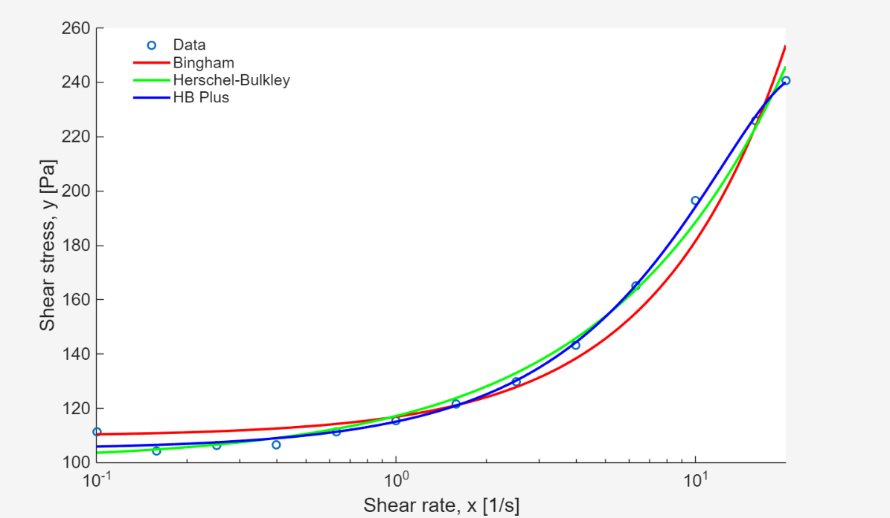

# Homework 3 Summary 

## Models 
- "The Bingham Model": $\hat{y}_B = \tau_y + \eta x$, with two parameters to be fit: $\tau_y$ and $\eta$.
- "The Hershel-Bulkley Model": $\hat{y}_H = \tau_y + K x^n$, with three parameters to be fit: $\tau_y$, $K$, and $n$.
- "The Hershel-Bulkley Plus Model": $\hat{y}_P
= \tau_y+K_1 x + K_2 x^n$ with four parameters to be fit: $\tau_y$, $K_1$, $K_2$, and $n$.

##Files
- `fit_linear.m`  
  Solves the linear least-squares problem for `Y ≈ Z*A`.

- `fit_nonlinear.m`  
  General nonlinear least-squares solver:
  - numerical Jacobian using finite differences (hard-coded `h = 1e-6`)
  - hard-coded `maxIter = 100`

- `nonlin_runner.m`  
  Loads `rheo_data.csv`, defines the three models, calls the fitting functions, and makes the required plot.

Data:
- `rheo_data.csv` (x in **[1/s]**, y in **[Pa]**)

## Results (from `rheo_data.csv`)
| Model | tau_y [Pa] | eta [Pa·s] | K | n | K1 | K2 | SSE |
|---|---:|---:|---:|---:|---:|---:|---:|
| Bingham | 109.740 | 7.198 | — | — | — | — | 6.34e2 |
| H–B | 100.474 | — | 16.749 | 0.721 | — | — | 1.90e2 |
| HB Plus | 104.936 | — | — | 2.412 | 10.253 | -0.0509 | 5.21e1 |

When working 

## Plot

