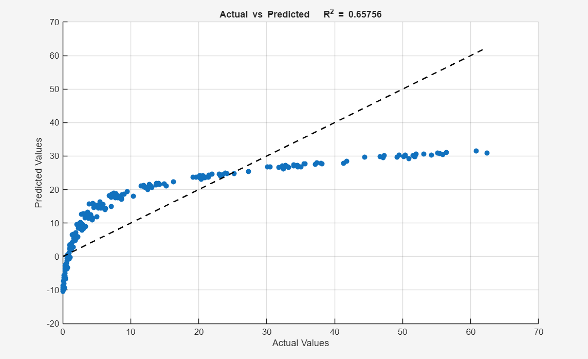
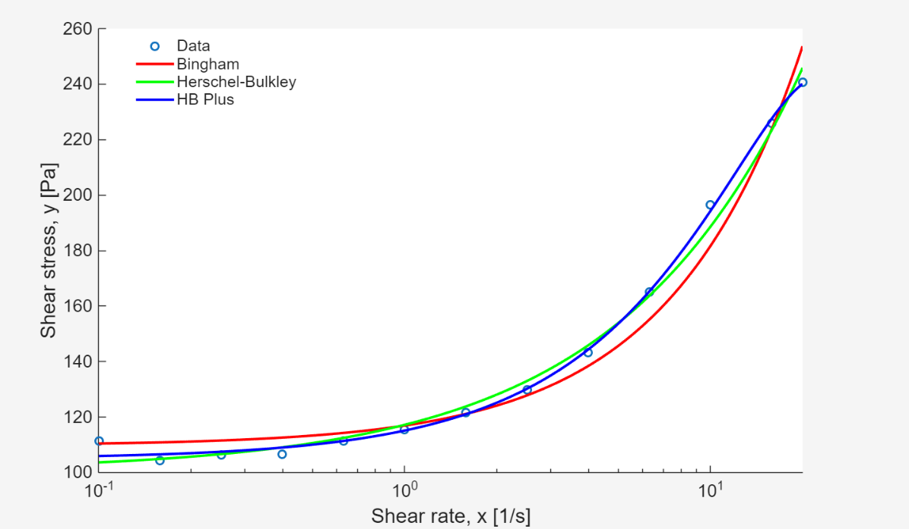

# Homework 3 Summary 

# Yacht Hydrodynamics Linear Regression

We fit a linear model to predict residuary resistance (wave/eddy drag) from six hull parameters:

$$\hat{y} = a_0 + a_1 x_1 + \cdots + a_6 x_6$$

## Fit Parameters

| | Variable | Value |
|---|---|---|
| $a_0$ | Intercept | −19.2367 |
| $a_1$ | Longitudinal center of buoyancy | +0.1938 |
| $a_2$ | Prismatic coefficient | −6.4194 |
| $a_3$ | Length-displacement ratio | +4.2330 |
| $a_4$ | Beam-draught ratio | −1.7657 |
| $a_5$ | Length-beam ratio | −4.5164 |
| $a_6$ | Froude number | +121.6676 |

Positive coefficients ($a_1$, $a_3$, $a_6$) increase resistance; negative ones ($a_2$, $a_4$, $a_5$) decrease it. The Froude number coefficient is by far the largest.

## Results

**R² = 0.6576.** The model captures the general trend but struggles at high resistance values, visible in the plot as points falling well below the ideal line. The relationship isn't truly linear, especially at higher speeds.

**"Cube boat" (all inputs = 1):**
$$\hat{y} = -19.2367 + 0.1938 - 6.4194 + 4.2330 - 1.7657 - 4.5164 + 121.6676 = 94.16$$

## Plot 
 

## Models 
- "The Bingham Model": $\hat{y}_B = \tau_y + \eta x$, with two parameters to be fit: $\tau_y$ and $\eta$.
- "The Hershel-Bulkley Model": $\hat{y}_H = \tau_y + K x^n$, with three parameters to be fit: $\tau_y$, $K$, and $n$.
- "The Hershel-Bulkley Plus Model": $\hat{y}_P
= \tau_y+K_1 x + K_2 x^n$ with four parameters to be fit: $\tau_y$, $K_1$, $K_2$, and $n$.

## Files
- `fit_linear.m`  
  Solves the linear least-squares problem for `Y ≈ Z*A`.

- `fit_nonlinear.m`  
  General nonlinear least-squares solver:
  - numerical Jacobian using finite differences (hard-coded `h = 1e-6`)
  - hard-coded `maxIter = 100`

- `nonlin_runner.m`  
  Loads `rheo_data.csv`, defines the three models, calls the fitting functions, and makes the required plot.

Data:
- `rheo_data.csv` (x in **[1/s]**, y in **[Pa]**)

## Results (from `rheo_data.csv`)
| Model | tau_y [Pa] | eta [Pa·s] | K | n | K1 | K2 | SSE |
|---|---:|---:|---:|---:|---:|---:|---:|
| Bingham | 109.740 | 7.198 | — | — | — | — | 6.34e2 |
| H–B | 100.474 | — | 16.749 | 0.721 | — | — | 1.90e2 |
| HB Plus | 104.936 | — | — | 2.412 | 10.253 | -0.0509 | 5.21e1 |

- A problem that I was continuing to run into was: "Warning: Matrix is singular, close to singular or badly scaled. Results may be inaccurate. RCOND = NaN." After 
 doing some research, my parameters were too close to eachother, making the matrix singular. This would cause my graph to only show 1-2 fit models. After some
  altering with the parameters, I was able to get the models to show without warning. 

## Plot

